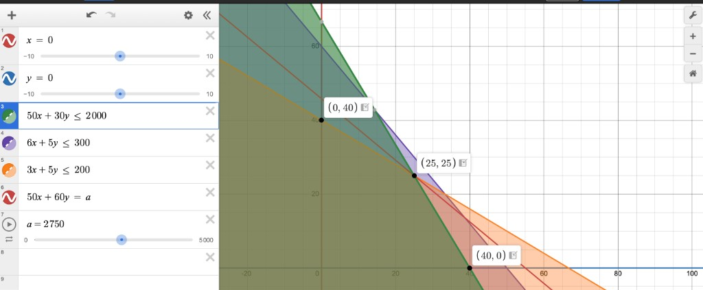
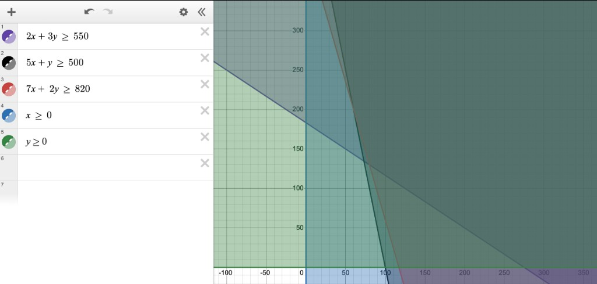
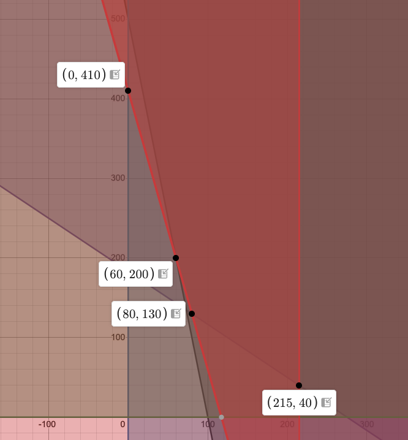

# THQ #2
### By: Ethan Le :D

## Question 1 (Sec 2.3: #1)

### Graph:

Given all the constraints, the feasible region is the shaded area where every inequality is satisfied at the same time. The extreme points of this region are the corner points where the boundary lines intersect, and all of them are marked on the graph: $(0, 40)$, $(25, 25)$, and $(40, 0)$.

The red line represents the objective function $50x + 60y = a$. To find the optimal solution, this line was slid upward (in the direction that increases the objective value) until it could not move any farther without leaving the feasible region. At that point, it touches the extreme point $(25, 25)$, which is where the objective function reaches its maximum value of $a = 2750$.

## Question 2 (Sec 2.2: #10)

### (a)

#### Variables:
- $X = \text{\# of pounds of feed X}$
- $Y = \text{\# of pounds of feed Y}$

#### Objective Function:

$$\boldsymbol{\min} \; 80X + 30Y \qquad \text{\textbf{(minimize cost in cents)}}$$

#### Constraints:
- $X, Y \geq 0 \qquad \text{\textbf{(non-negative)}}$
- $2X + 3Y \geq 550 \qquad \text{\textbf{(nutritious element A)}}$
- $5X + Y \geq 500 \qquad \text{\textbf{(nutritious element B)}}$
- $7X + 2Y \geq 820 \qquad \text{\textbf{(nutritious element C)}}$

### Graph:

This is a quick sketch of the feasible region. Since the feasible region is bounded by lines, its corner points come from intersections of constraint pairs. From the graph, the relevant pairs are:

- $5X + Y \geq 500$ and $7X + 2Y \geq 820$
- $2X + 3Y \geq 550$ and $7X + 2Y \geq 820$
- $5X + Y \geq 500$ and $X \geq 0$
- $2X + 3Y \geq 550$ and $Y \geq 0$

#### Intersection of $5X + Y \geq 500$ and $7X + 2Y \geq 820$

At the boundary, solve the system:

$$5X + Y = 500$$
$$7X + 2Y = 820$$

From the first equation, $Y = 500 - 5X$. Substituting into the second:

$$7X + 2(500 - 5X) = 820$$
$$7X + 1000 - 10X = 820$$
$$-3X = -180$$
$$X = 60$$

Then $Y = 500 - 5(60) = 200$, so the intersection is $(60, 200)$.

#### Intersection of $2X + 3Y \geq 550$ and $7X + 2Y \geq 820$

At the boundary, solve the system:

$$2X + 3Y = 550$$
$$7X + 2Y = 820$$

Multiply the first equation by $2$ and the second by $3$:

$$4X + 6Y = 1100$$
$$21X + 6Y = 2460$$

Subtracting the first from the second:

$$17X = 1360 \implies X = 80$$

Substitute back into $2X + 3Y = 550$:

$$2(80) + 3Y = 550 \implies 3Y = 390 \implies Y = 130$$

So the intersection is $(80, 130)$.

#### Intersection of $5X + Y \geq 500$ and $X \geq 0$

On the boundary $X = 0$, substitute into $5X + Y = 500$:

$$5(0) + Y = 500 \implies Y = 500$$

So the intersection is $(0, 500)$.

#### Intersection of $2X + 3Y \geq 550$ and $Y \geq 0$

On the boundary $Y = 0$, substitute into $2X + 3Y = 550$:

$$2X + 3(0) = 550 \implies X = 275$$

So the intersection is $(275, 0)$.

#### Extreme Points and Objective Function

| Extreme Point $(X, Y)$ | $80X + 30Y$ |
| ---------------------- | ----------- |
| $(60, 200)$            | $10{,}800$  |
| $(80, 130)$            | $10{,}300$  |
| $(0, 500)$             | $15{,}000$  |
| $(275, 0)$             | $22{,}000$  |

The minimum cost is $10{,}300$ cents, achieved at $(80, 130)$.

### (c)

$$\boldsymbol{\min} \; cX + 30Y \qquad \text{\textbf{(minimize cost in cents)}}$$

This part was kind of hard, but I think Ima just do it the way we did it in class. 
The constraints are unchanged from part (a). 

#### Slope Analysis

Rewrite the objective as a line:

$$cX + 30Y = k \implies Y = -\frac{c}{30}X + \frac{k}{30}$$

So the slope of the objective function is $-\dfrac{c}{30}$. As $c$ increases, this slope gets steeper.

The slopes of the binding constraint boundaries are:

| Constraint | Boundary | Slope |
| ---------- | -------- | ----- |
| $5X + Y \geq 500$ | $Y = 500 - 5X$ | $-5$ |
| $7X + 2Y \geq 820$ | $Y = 410 - \dfrac{7}{2}X$ | $-\dfrac{7}{2}$ |
| $2X + 3Y \geq 550$ | $Y = \dfrac{550}{3} - \dfrac{2}{3}X$ | $-\dfrac{2}{3}$ |

For a minimization problem, slide the objective line in the direction that decreases cost. The optimal solution is the corner point the line last touches before leaving the feasible region. When the objective slope matches a constraint slope, the optimum lies along that entire edge.

Set $-\dfrac{c}{30}$ equal to each constraint slope to find where the optimal point changes:

$$-\frac{c}{30} = -\frac{2}{3} \implies c = 20 \qquad \text{(parallel to } 2X + 3Y = 550 \text{, edge from } (80, 130) \text{ to } (275, 0) \text{)}$$

$$-\frac{c}{30} = -\frac{7}{2} \implies c = 105 \qquad \text{(parallel to } 7X + 2Y = 820 \text{, edge from } (60, 200) \text{ to } (80, 130) \text{)}$$

$$-\frac{c}{30} = -5 \implies c = 150 \qquad \text{(parallel to } 5X + Y = 500 \text{, edge from } (0, 500) \text{ to } (60, 200) \text{)}$$

Ordering the slopes from flattest to steepest gives the optimal corner in each range:

| Range of $c$ | Objective Slope | Optimal Point |
| ------------ | --------------- | ------------- |
| $c < 20$ | flatter than $-\dfrac{2}{3}$ | $(275, 0)$ |
| $20 \leq c \leq 105$ | between $-\dfrac{2}{3}$ and $-\dfrac{7}{2}$ | $(80, 130)$ |
| $105 \leq c \leq 150$ | between $-\dfrac{7}{2}$ and $-5$ | $(60, 200)$ |
| $c > 150$ | steeper than $-5$ | $(0, 500)$ |

At $c = 105$, the objective is parallel to $7X + 2Y = 820$, so every point on the edge from $(80, 130)$ to $(60, 200)$ is optimal (in particular both corners).

At $c = 80$, the slope is $-\dfrac{8}{3}$, which falls in the range $20 \leq c \leq 105$. From what I am thinking, when the cost slightly increases past 105 (in other words a cost increase of strictly over 25), the optimal point changes to (60, 200), hence the new optimal feed of 60lbs of feed X and 200lbs of feed Y.

### (d)

To the problem from part (a), add the constraint $X \leq 215$.

#### Variables:
- $X = \text{\# of pounds of feed X}$
- $Y = \text{\# of pounds of feed Y}$

#### Objective Function:

$$\boldsymbol{\min} \; 80X + 30Y \qquad \text{\textbf{(minimize cost in cents)}}$$

#### Constraints:
- $X, Y \geq 0 \qquad \text{\textbf{(non-negative)}}$
- $2X + 3Y \geq 550 \qquad \text{\textbf{(nutritious element A)}}$
- $5X + Y \geq 500 \qquad \text{\textbf{(nutritious element B)}}$
- $7X + 2Y \geq 820 \qquad \text{\textbf{(nutritious element C)}}$
- $X \leq 215 \qquad \text{\textbf{(feed X availability)}}$

### Graph:

This could be solved algebraically by finding where $X = 215$ intersects the other constraints, but I graphed it instead to make finding the corner points easier. From the graph, the extreme points of the feasible region are $(0, 500)$, $(60, 200)$, $(80, 130)$, and $(215, 40)$.

#### Extreme Points and Objective Function

| Extreme Point $(X, Y)$ | $80X + 30Y$ |
| ---------------------- | ----------- |
| $(0, 500)$             | $15{,}000$  |
| $(60, 200)$            | $10{,}800$  |
| $(80, 130)$            | $10{,}300$  |
| $(215, 40)$            | $18{,}400$  |

The minimum cost is $10{,}300$ cents, achieved at $(80, 130)$.
