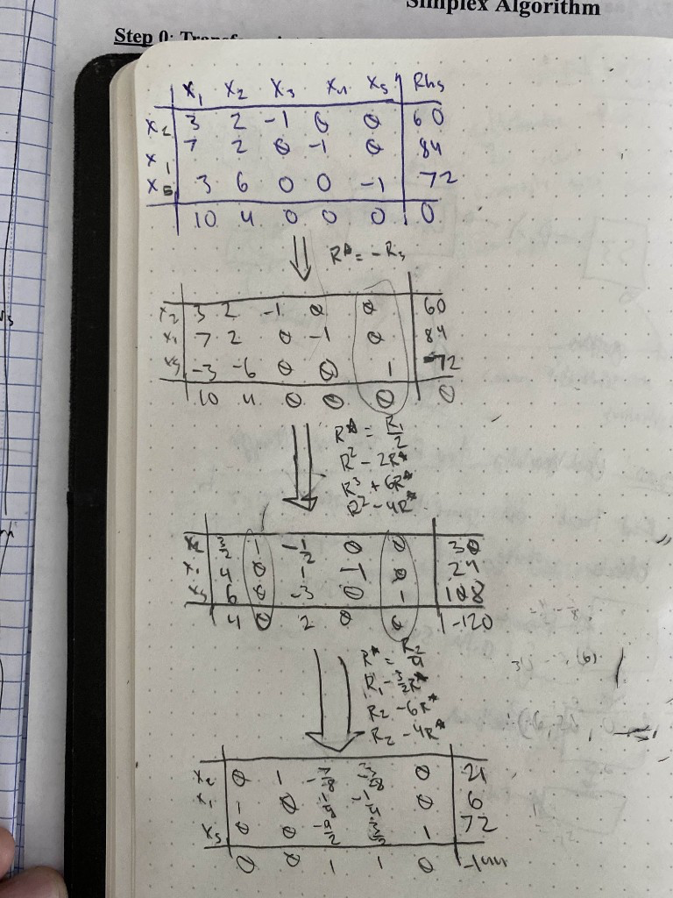
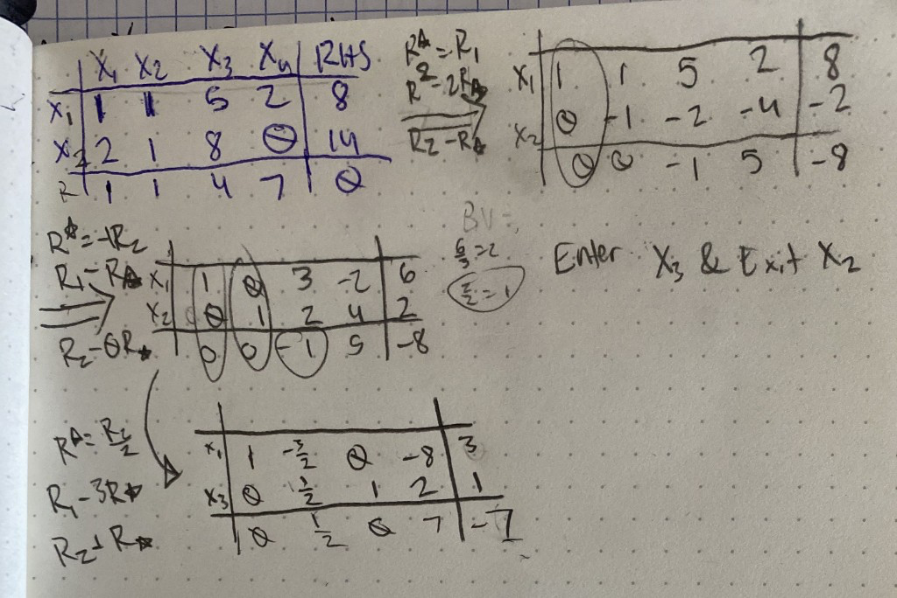

# THQ #3
### By: Ethan Le :D

## Question 1 (Sec 3.1)

Put the following problems into standard form.

### (a)

#### Objective Function:

$$\boldsymbol{\max} \; 3x_1 - 2x_2$$

#### Constraints:
- $5x_1 + 2x_2 - 3x_3 + x_4 \leq 7$
- $3x_2 - 4x_3 \leq 6$
- $x_1 + x_3 - x_4 \geq 11$
- $x_1, x_2, x_3, x_4 \geq 0 \qquad \text{\textbf{(non-negative)}}$

Ok so I understand that max has to be turned into a minimum, and we need to create slack variables to help turn these inequalities to equalities.

### Solved:

#### Objective Function:

$$\boldsymbol{\min} \; -3x_1 + 2x_2$$

#### Constraints:
- $5x_1 + 2x_2 - 3x_3 + x_4 + s_1 = 7$
- $3x_2 - 4x_3 + s_2 = 6$
- $x_1 + x_3 - x_4 - s_3 = 11$
- $x_1, x_2, x_3, x_4, s_1, s_2, s_3 \geq 0 \qquad \text{\textbf{(non-negative)}}$

### (b)

#### Objective Function:

$$\boldsymbol{\min} \; x_2 + x_3 + x_4$$

#### Constraints:
- $x_1 + x_2 \geq 6$
- $x_2 + x_3 - x_4 \leq 1$
- $5x_1 - 6x_2 + 7x_3 - 8x_4 \geq 2$
- $x_1 \geq 0$, $x_2 \leq 0$, $x_3, x_4$ unrestricted

Since the obj funciton is minimized, I'll leave it alone. For inequalites, I'll add some slack variables as needed, and for the unrestricted variables, I'll separate each of them to it's positive an negative, and make sure to show that everywhere. Since X2 is negative, I need to make it positive as well, multiplying all X2 terms by -1.

### Solved:

#### Objective Function:

$$\boldsymbol{\min} \; -x_2 + x_3' - x_3'' + x_4' - x_4''$$

#### Constraints:
- $x_1 - x_2 - s_1 = 6$
- $-x_2 + x_3' - x_3'' - x_4' + x_4'' + s_2 = 1$
- $5x_1 + 6x_2 + 7x_3' - 7x_3'' - 8x_4' + 8x_4'' - s_3 = 2$
- $x_1, x_2, x_3', x_3'', x_4', x_4'', s_1, s_2, s_3 \geq 0 \qquad \text{\textbf{(non-negative)}}$

## Question 2 (Sec 3.2)

#### Objective Function:

$$\boldsymbol{\min} \; 10x_1 + 4x_2$$

#### Constraints:
- $3x_1 + 2x_2 - x_3 = 60$
- $7x_1 + 2x_2 - x_4 = 84$
- $3x_1 + 6x_2 - x_5 = 72$
- $x_1, x_2, x_3, x_4, x_5 \geq 0 \qquad \text{\textbf{(non-negative)}}$

### Simplex Algorithm:

#### Solution:

$$x_3 + x_4 = -144 + z \implies z = 144 \quad \text{at } (6, 21, 0, 0, 72)$$

## Question 3 (Sec 3.3)

Use the simplex method covered in this class (with simplex tableau) to solve the following LP model, using $x_1$ and $x_2$ as the initial BV.

#### Objective Function:

$$\boldsymbol{\min} \; x_1 + x_2 + 4x_3 + 7x_4$$

#### Constraints:
- $x_1 + x_2 + 5x_3 + 2x_4 = 8$
- $2x_1 + x_2 + 8x_3 = 14$
- $x_1, x_2, x_3, x_4 \geq 0 \qquad \text{\textbf{(non-negative)}}$

### Simplex Algorithm:

#### Solution:

$$\frac{1}{2}x_2 + 7x_4 = -7 + z \implies z = 7 \quad \text{at } (3, 0, 1, 0)$$

