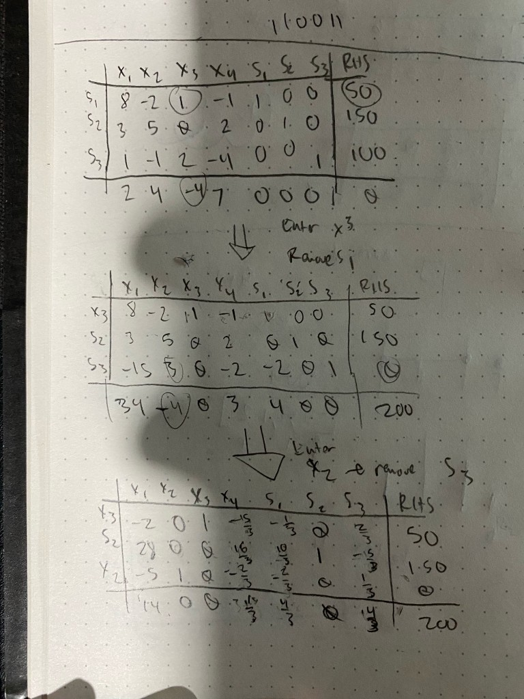
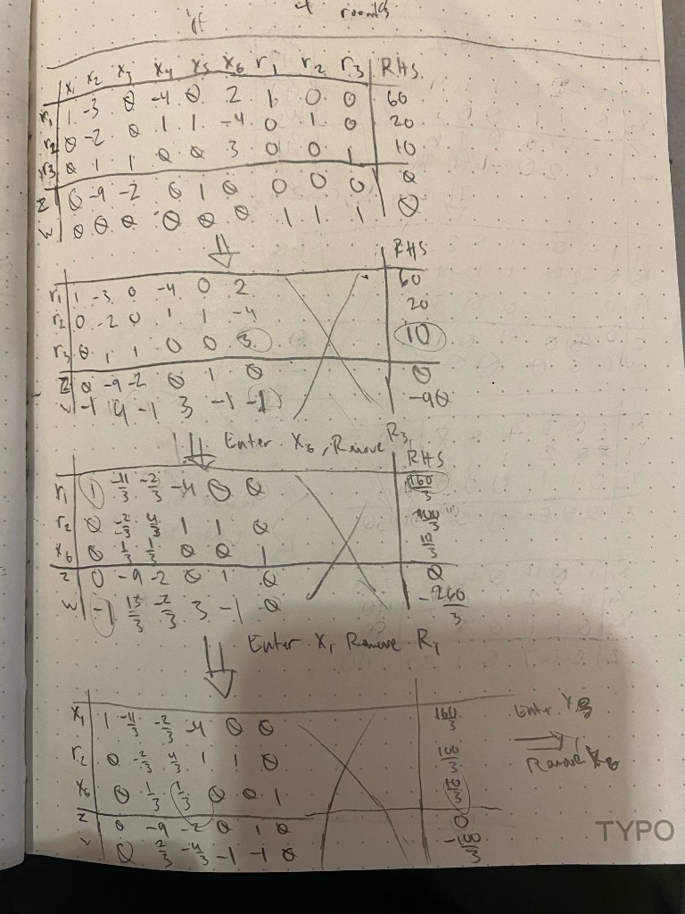
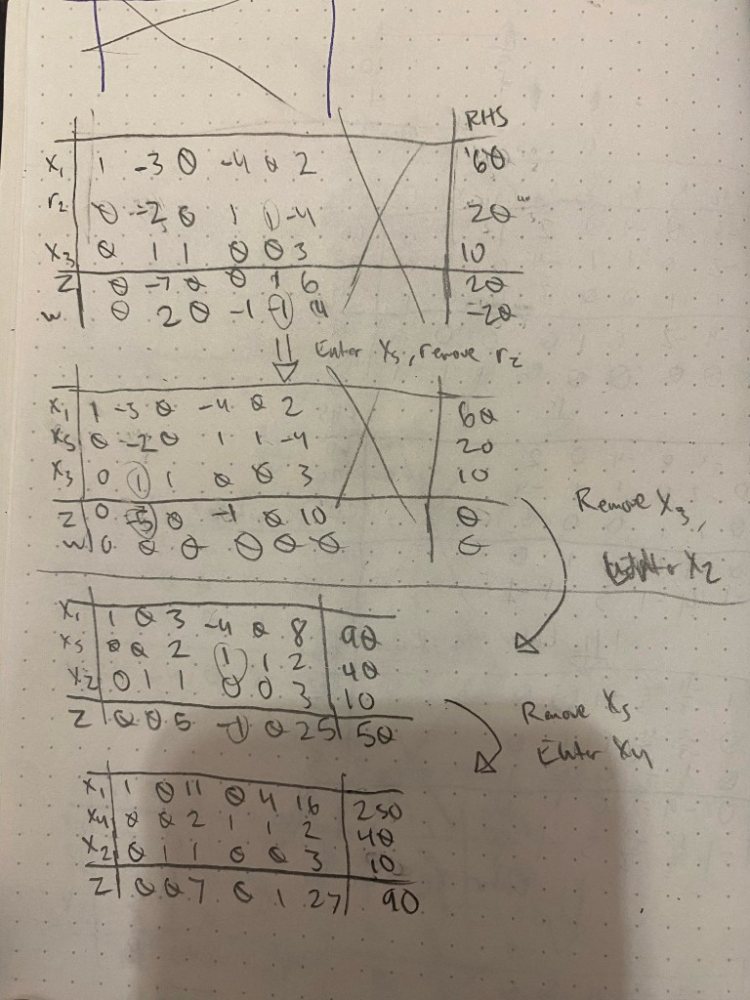
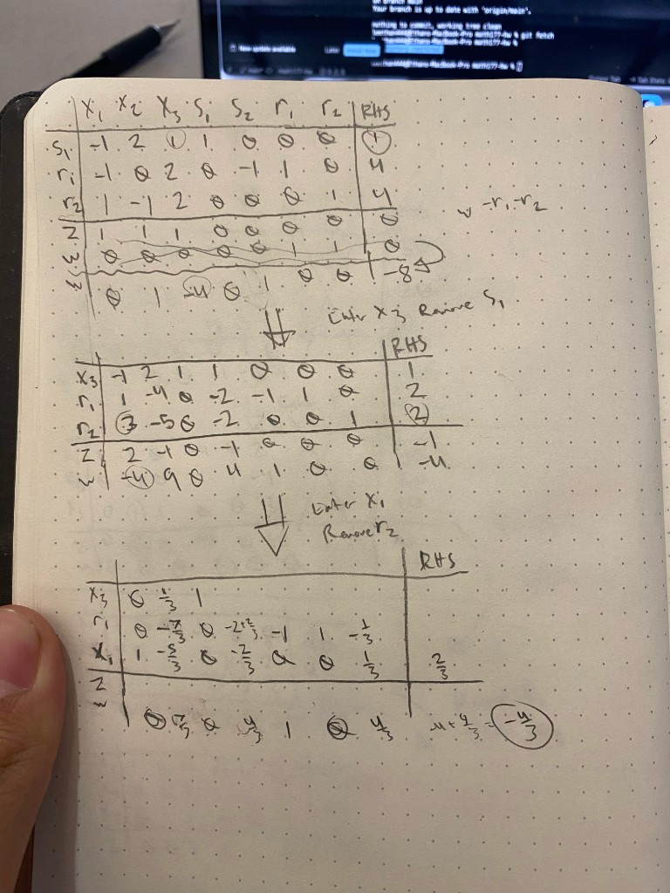
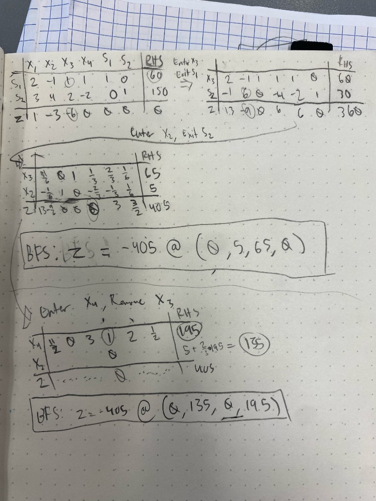

# THQ #4
### By: Ethan Le :D

## Question 1 

#### Objective Function:

$$\boldsymbol{\min} \; 2x_1 + 4x_2 - 4x_3 + 7x_4$$

#### Constraints:
- $8x_1 - 2x_2 + x_3 - x_4 \leq 50$
- $3x_1 + 5x_2 + 2x_4 \leq 150$
- $x_1 - x_2 + 2x_3 - 4x_4 \leq 100$
- $x_1, x_2, x_3, x_4 \geq 0 \qquad \textbf{(non-negative)}$

The first step is to add slack variables $s_1$, $s_2$, and $s_3$ so everything is in canonical form. Since each constraint is already a $\leq$ inequality with a positive right-hand side, I add a non-negative slack to each equation (no surplus or flipping signs needed).

### Canonical Form:

#### Objective Function:

$$\boldsymbol{\min} \; 2x_1 + 4x_2 - 4x_3 + 7x_4$$

#### Constraints:
- $8x_1 - 2x_2 + x_3 - x_4 + s_1 = 50$
- $3x_1 + 5x_2 + 2x_4 + s_2 = 150$
- $x_1 - x_2 + 2x_3 - 4x_4 + s_3 = 100$
- $x_1, x_2, x_3, x_4, s_1, s_2, s_3 \geq 0 \qquad \textbf{(non-negative)}$

### Simplex Algorithm:

#### Solution:

Optimal minimum is $-200$ at $(x_1, x_2, x_3, x_4, s_1, s_2, s_3) = (0, 0, 50, 0, 0, 150, 0)$.

## Question 2

#### Objective Function:

$$\boldsymbol{\max} \; 9x_2 + 2x_3 - x_5$$

#### Constraints:
- $x_1 - 3x_2 - 4x_4 + 2x_6 = 60$
- $2x_2 - x_4 - x_5 + 4x_6 = -20$
- $x_2 + x_3 + 3x_6 = 10$
- $x_1, x_2, x_3, x_4, x_5, x_6 \geq 0 \qquad \textbf{(non-negative)}$

To match the min approach from class, I negate the objective so maximizing $9x_2 + 2x_3 - x_5$ becomes minimizing $-9x_2 - 2x_3 + x_5$. Since every constraint is an equality, I add artificial variables $r_1$, $r_2$, and $r_3$ as the initial basic variables. I also multiply the second constraint by $-1$ so the right-hand side is positive. Using the Two-Phase method, Phase I minimizes the sum of the artificials to drive them out of the basis; Phase II then optimizes the original (negated) objective.

### Phase I:

#### Objective Function:

$$\boldsymbol{\min} \; w = r_1 + r_2 + r_3$$

#### Constraints:
- $x_1 - 3x_2 - 4x_4 + 2x_6 + r_1 = 60$
- $-2x_2 + x_4 + x_5 - 4x_6 + r_2 = 20$
- $x_2 + x_3 + 3x_6 + r_3 = 10$
- $x_1, x_2, x_3, x_4, x_5, x_6, r_1, r_2, r_3 \geq 0 \qquad \textbf{(non-negative)}$

Initial BVs: $r_1 = 60$, $r_2 = 20$, $r_3 = 10$ (all other variables $= 0$).

### Phase II:

Once Phase I reaches $w = 0$ with all artificials nonbasic, drop the $r_i$ columns and optimize:

$$\boldsymbol{\min} \; z = -9x_2 - 2x_3 + x_5$$

### Simplex Algorithm:

#### Phase I Tableaus:

#### Phase II Tableaus:

#### Solution:

$$z_{\max} = 90 \quad \text{at } (x_1, x_2, x_3, x_4, x_5, x_6) = (250, 10, 0, 40, 0, 0)$$

## Question 3

#### Objective Function:

$$\boldsymbol{\min} \; z = x_1 + x_2 + x_3$$

#### Constraints:
- $-x_1 + 2x_2 + x_3 \leq 1$
- $-x_1 + 2x_3 \geq 4$
- $x_1 - x_2 + 2x_3 = 4$
- $x_1, x_2, x_3 \geq 0 \qquad \textbf{(non-negative)}$

To put this in equation form for Two-Phase simplex: add a slack $s_1$ to the $\leq$ constraint, subtract a surplus $s_2$ and add an artificial $r_1$ to the $\geq$ constraint, and add an artificial $r_2$ to the $=$ constraint. The initial basic variables are then $s_1$, $r_1$, and $r_2$.

### Canonical Form (with Slack, Surplus, and Artificial Variables):

#### Constraints:
- $-x_1 + 2x_2 + x_3 + s_1 = 1$
- $-x_1 + 2x_3 - s_2 + r_1 = 4$
- $x_1 - x_2 + 2x_3 + r_2 = 4$
- $x_1, x_2, x_3, s_1, s_2, r_1, r_2 \geq 0 \qquad \textbf{(non-negative)}$

### Phase I:

#### Objective Function:

$$\boldsymbol{\min} \; w = r_1 + r_2$$

Initial BVs: $s_1 = 1$, $r_1 = 4$, $r_2 = 4$ (all other variables $= 0$).

### Phase II:

Once Phase I reaches $w = 0$ with all artificials nonbasic, drop the $r_i$ columns and optimize:

$$\boldsymbol{\min} \; z = x_1 + x_2 + x_3$$

### Simplex Algorithm:

#### Solution:

The problem is **infeasible**. At the end of Phase I, every entry in the $w$-row (among the variable columns) is nonnegative, so Phase I is optimal, but $w$ is not zeroed out (RHS $= -4/3$, so $w = 4/3 > 0$). An artificial variable remains positive, so there is no feasible solution to the original LP, and Phase II is not needed.

## Question 4

Determine two distinct basic feasible solutions at which the optimal value of the objective function is attained.

#### Objective Function:

$$\boldsymbol{\min} \; x_1 - 3x_2 - 6x_3$$

#### Constraints:
- $2x_1 - x_2 + x_3 + x_4 \leq 60$
- $3x_1 + 4x_2 + 2x_3 - 2x_4 \leq 150$
- $x_1, x_2, x_3, x_4 \geq 0 \qquad \textbf{(non-negative)}$

Both constraints are $\leq$, so I add slack variables $s_1$ and $s_2$ to put the problem in canonical form. No artificial variables are needed.

### Canonical Form:

#### Objective Function:

$$\boldsymbol{\min} \; x_1 - 3x_2 - 6x_3$$

#### Constraints:
- $2x_1 - x_2 + x_3 + x_4 + s_1 = 60$
- $3x_1 + 4x_2 + 2x_3 - 2x_4 + s_2 = 150$
- $x_1, x_2, x_3, x_4, s_1, s_2 \geq 0 \qquad \textbf{(non-negative)}$

### Simplex Algorithm:

At the first optimal tableau, a nonbasic variable ($x_4$) has a zero coefficient in the objective row. That means bringing $x_4$ into the basis does not change the objective value, so I can pivot on that column to get a different BFS that is still optimal.

#### Solution:

Two distinct optimal basic feasible solutions, both with $z = -405$:

- $(x_1, x_2, x_3, x_4) = (0, 5, 65, 0)$
- $(x_1, x_2, x_3, x_4) = (0, 135, 0, 195)$

